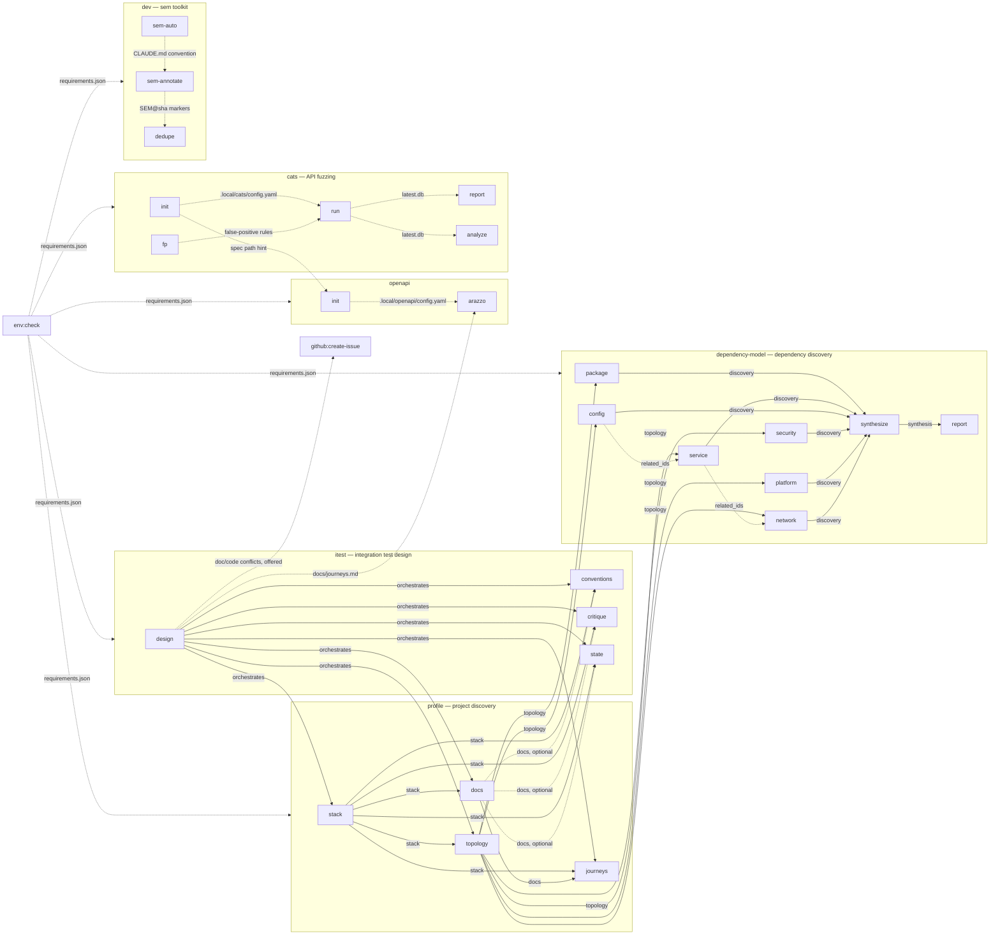

# Marketplace architecture

How the `efitz-skills` plugins compose. The [README](../README.md) says what each
skill does; this document says what each skill *hands to* another, and in what form.

Read this before adding a plugin that builds on an existing one, and update it as
part of that plugin's definition of done — see [Keeping this current](#keeping-this-current).

## How plugins compose

Three kinds of coupling, listed from most stable to least. The kind matters: it
determines whether you can build on the edge and expect it to keep working.

| Coupling | Mechanism | Stability |
|---|---|---|
| **Contract** | A versioned JSON schema under `<plugin>/references/contracts/`. The producing skill emits exactly one conforming JSON object into the conversation; the consumer is handed it, or invokes the producer itself when running standalone. | **Supported interface.** Build on these. |
| **Artifact** | A file on disk that one skill writes and another reads from a well-known path — `docs/journeys.md`, `results_dir/latest.db`, `SEM@<sha>` source comments. | Stable path, but the format is owned by the writer. |
| **Local config** | `.local/<plugin>/config.yaml` and the shared `.local/repos.json` / `.local/gh-projects.json`. Provisioned out of band or by an `init` skill; consumer skills read, never write. | Per-repo and machine-local; never committed except where noted. |

Two conventions hold across every composed skill:

- **A skill invoked standalone bootstraps its own inputs.** `itest:critique` handed
  no `stack` contract invokes `profile:stack` itself. Contracts are an optimization
  against re-discovery, not a hard prerequisite.
- **Skills call each other by name, never by path.** No skill reaches into another
  plugin's `scripts/` directory. Crossing a plugin boundary means invoking a skill or
  reading a documented artifact.

## Dependency graph

Solid edges carry a contract. Dashed edges are artifacts, config, or optional
invocations. Edge labels name what actually crosses the boundary.

`env:check` is drawn against whole plugins because it reads every plugin's sidecar
`requirements.json` — including the plugins omitted above. It consumes no skill output
and produces none; it is a preflight, not a stage.

### Reading the core chain

`profile:stack` is the gate. Its contract carries the repo inventory produced by
`profile_inventory.py`, so no downstream skill re-runs the census. `profile:docs` is the
second gate: `journeys` and the `itest` discovery skills read the documentary record
from its contract rather than re-reading the documents.

`itest:design` is the only orchestrator in the marketplace. It runs the two gates in
sequence, fans the remaining five phases out concurrently, holds a human confirmation
gate, and emits the `scenario` contract. Its durable side effect is `docs/journeys.md` —
the confirmed journey set, with the `profile:journeys` contract in a fenced JSON block at
the end. That file is the handoff to `openapi:arazzo`, which is why the arazzo skill can
skip discovery entirely.

`profile:topology` is the seed for all six `dependency-model` discovery skills — the same
refinement-tier relationship `stack` has to `topology`, and the same one-way direction
`itest` has to `profile`.

## Skill catalog

Skills grouped by plugin. **Outputs** names the durable result; **consumes** names what
it needs handed to it, blank when it needs nothing from another skill.

### profile

| Skill | Value produced | Outputs | Consumes |
|---|---|---|---|
| `stack` | What the codebase is built with — languages, runtimes, package managers, build commands, monorepo layout | `stack` contract, carrying the full inventory census | — |
| `docs` | What the project's own record says it must do — requirements, journey evidence, glossary, invariants | `docs` contract | `stack` |
| `topology` | How the system deploys — components, real dependencies, third parties, config mechanism, startup order, standup difficulty | `topology` contract | `stack` |
| `journeys` | The workflows users actually perform, ranked, with dependency edges — **candidates for a human to confirm** | `journeys` contract | `stack`, `docs` |

### itest

| Skill | Value produced | Outputs | Consumes |
|---|---|---|---|
| `design` | A prioritized integration-test scenario plan, with a chosen boundary, a gap map, and recorded doc/code conflicts | `scenario` contract, printed plan, `docs/journeys.md` | orchestrates all four `profile` skills and the three below |
| `conventions` | How tests are written and run here — frameworks, runner commands, unit/integration separation, house style | `conventions` contract | `stack`; `docs` optional |
| `critique` | Which existing tests mislead — over-mocking, implementation-detail assertions, non-determinism; keep/repair/replace/delete per test | `critique` contract | `stack`; `docs` optional |
| `state` | How test state can be established and torn down — writable stores, factories, seeds, test-only endpoints | `state` contract | `stack`; `docs` optional |

### openapi

| Skill | Value produced | Outputs | Consumes |
|---|---|---|---|
| `init` | The project's OpenAPI and Arazzo spec locations, discovered and verified | `.local/openapi/config.yaml` | `.local/cats/config.yaml` as a spec hint, when present |
| `arazzo` | Confirmed journeys expressed as an Arazzo 1.0 workflow spec bound to real operations | `arazzo.yaml` | `docs/journeys.md`, `.local/openapi/config.yaml` |

### cats

| Skill | Value produced | Outputs | Consumes |
|---|---|---|---|
| `init` | Per-repo fuzzing setup, validated by a doctor check | `.local/cats/config.yaml`, committed false-positive rules file | — |
| `run` | An executed fuzzing campaign, parsed and classified | run database, `latest.db` symlink | config, false-positive rules |
| `report` | Answers from the results database; also *is* the schema reference | queries and rendered reports | `latest.db` |
| `analyze` | Triage of true positives into real bug / spec gap / false-positive candidate, evidence-backed | remediation plan | `latest.db` |
| `fp` | Declarative false-positive rules, added only after a mandatory dry run | committed rules file | `latest.db` for the dry run |

### dependency-model

| Skill | Value produced | Outputs | Consumes |
|---|---|---|---|
| `package` | The libraries the system ships with, with declared/locked/installed resolution and the dependency edges between them | `discovery` contract, `package` category | `topology`; `syft` |
| `service` | Out-of-project services — databases, caches, queues, object stores, search, APIs — with how each is brought up and how it is declared to fail | `discovery` contract, `service` category | `topology`, `depscan.py` index |
| `config` | The configuration the system must be supplied with, with what reads each key and what it declares as required or defaulted | `discovery` contract, `config` category | `topology`, `depscan.py` index |
| `security` | The credential and permission surface — what each secret is named and where it is read, never its value | `discovery` contract, `security` category | `topology`, `depscan.py` index |
| `platform` | Declared OS and cloud resources — CPU, memory, disk, GPU, architecture, runtime versions, managed services | `discovery` contract, `platform` category | `topology`, `depscan.py` index |
| `network` | The names, hosts, and ports that must resolve and connect, inbound and outbound | `discovery` contract, `network` category | `topology`, `depscan.py` index |
| `synthesize` | Merges the six discovery contracts into one inventory and graph, and derives which dependencies carry a failure-relevant health condition | `synthesis` contract | all six `discovery` contracts |
| `report` | Renders the `synthesis` contract into a human-readable document — inventory by category, health definitions, dependency graph, cycles, and assumptions | `docs/dependencies.md` | `synthesis` contract |

All six discovery skills emit the same `discovery` envelope with exactly one key
under `categories` populated, so merging them is a key union rather than a
transform. `synthesize` is this layer's orchestrator: it gathers all six
contracts, merges them via `depgraph.py` into one inventory and graph, and
derives the health view from the merged inventory's resilience facts, emitting
the `synthesis` contract. `report` renders that contract into
`docs/dependencies.md`, adding no facts of its own.

### dev

| Skill | Value produced | Outputs | Consumes |
|---|---|---|---|
| `sem-annotate` | Durable `SEM@<sha>` intent markers on code entities, drift-aware | markers in source | — |
| `sem-auto` | A project that keeps its own markers fresh | a convention block in the project's `CLAUDE.md` | — |
| `dedupe` | Ranked, risk-assessed dead-code and duplication plan, each candidate verified by a subagent | plan, optionally applied | `SEM@<sha>` markers |

### Self-contained plugins

These have no cross-plugin edges. Internal orchestration is noted where it exists.

| Plugin | Skills | Notes |
|---|---|---|
| `loc` | `analyze`, `coverage`, `detect-nonloc`, `translate-to`, `update-json`, `validate-translation`, `backfill` | `backfill` orchestrates the other six; `analyze` and `coverage` share the bundled `check-i18n.py` |
| `logseq` | `capture`, `query`, `lint`, `organize`, `from-obsidian` | All mechanics go through one bundled CLI |
| `github` | `backlog`, `create-issue` | Both read `.local/repos.json`; `create-issue` also reads `.local/gh-projects.json` |
| `security` | `vet-plugin`, `race-cond` | — |
| `deps` | `bump` | Thin orchestrator over the `bumplib` CLI |
| `wiki` | `verify-doc` | Reads `.local/repos.json` |
| `ui` | `vrt` | Reads `.local/repos.json` when present, else falls back to `gh` defaults |
| `writing` | `boring` | Bundles a deterministic analyzer |
| `env` | `check` | Reads every plugin's `requirements.json` |

## Entry points

| Goal | Start here | Then |
|---|---|---|
| Understand an unfamiliar repo | `/profile:stack` | `/profile:docs`, then `topology` or `journeys` as needed |
| Design an integration test suite | `/itest:design` | It runs the whole `profile` + `itest` chain and gates on your confirmation |
| Generate an Arazzo workflow spec | `/itest:design` | `/openapi:init`, then `/openapi:arazzo` — arazzo needs the confirmed `docs/journeys.md` |
| Fuzz an API | `/cats:init` | `/cats:run`, then `/cats:analyze`; `/cats:fp` to suppress confirmed false positives |
| Find dead code and duplication | `/dev:sem-annotate` | `/dev:dedupe`; `/dev:sem-auto` to keep markers fresh afterwards |
| Audit a system's deployment shape and dependencies | `/profile:stack` | `/profile:topology` |
| Update dependencies | `/deps:bump` | — |
| Confirm the tooling is installed | `/env:check` | `--fix` for declared remedies |

## Keeping this current

A plugin that adds a cross-plugin edge is not done until this document reflects it:

1. Add the node and the labelled edge to the graph, using the solid/dashed convention.
2. Add or update the plugin's rows in the skill catalog.
3. Add an entry-point row if the plugin serves a goal a user would state directly.

New contracts live at `<plugin>/references/contracts/<name>.schema.json` with a worked
example beside them in `examples/`, matching the `profile` and `itest` house style.
